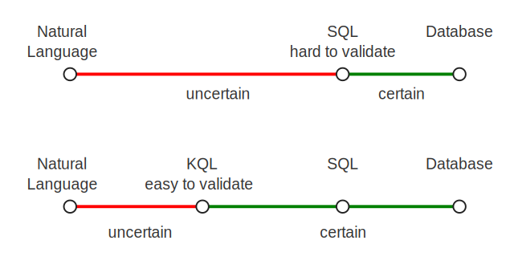

# koryki.ai/core

koryki.ai/core library improves the interaction of business users with relational databases for searches and data analysis
assisted by Large Language Models (LLM).

By introducing an easy-to-understand and easily verifiable query language (**kql**), users remain in the driver's seat.

**kql** avoids the ambiguities and redundancy of SQL. **kql** has a concise grammar, making it easy to learn.

Further measures to reduce the complexity users face during data analysis:

- introducing a business model on top of the database schema using business terms instead of exposing database internals.
- labeling entity relations to hide join criteria
- skip details that humans have in mind or AI models already know from context or do not need to know.
- hide database techniques for optimization, like partitioned tables, function-based indexes,
  precalculated values like soundex, etc.

Each step of abstraction with determined processing reduces the complexity visible to users and LLMs.
These determined processes can be handled reliably by SQL generation.
This makes it easier for users to understand and verify the queries to be executed.
It also reduces the effort for LLMs to calculate.

Beyond syntax checks, there is no such thing as 'right' or 'wrong' about a query. It all depends on the user's needs and expectations. 
Assisting the user to understand system behavior is truly most important
to increase productivity and quality in data analysis.

# MCP-Server

With the help of the koryki.ai MCP–Server, users can gain read access to databases with the support of an AI-model, see
[Model-Context-Protocol](https://modelcontextprotocol.io/docs/getting-started/intro "(MCP)").

The primary task of the koryki.ai MCP-Server is to bridge the gap between queries in **kql**-form and the formal languages for relational databases (SQL).

For this purpose, koryki.ai introduces two query languages:
* **kql**: korykiai query language aims to formulate queries in an easily understandable form.
* **iql**: intermediate query language serves the purpose of supplementing queries with technical information using rule sets. This language takes into account the implicit expectations of users. Details required by databases but irrelevant to users are introduced here.

After the AI model has converted the natural language query into **kql**-form,
the koryki.ai MCP-server converts this query into **iql**-form,
enriches and transforms the query using rule sets, and finally generates the SQL
appropriate for the database system.

### Let's have a look at a sample:

User enters:

    Find customers who have placed more than 10 orders in January 2023,
    return companyname and count, sort by count.

With the help of published resources about koryki.ai, **kql**-grammar, and the entity-relationship model
AI may create a query in **kql**-form:

    FIND customers c, c-orders o
    FILTER count(o) > 10 AND 
        o.order_date BETWEEN DATE '2023-01-01' AND DATE '2023-01-31'
    FETCH c.company_name, count(o)
    ORDER count(o) DESC

The same query in **iql**:

    SELECT
        "customers" "c"
            OUT "c"."company_name" 1
            GROUP "c"."company_name"
        JOIN "orders" "o"
            OUT count("o"."order_id") 2
            FILTER "o"."order_date" BETWEEN DATE '2023-01-01' AND DATE '2023-01-31'
            HAVING count("o"."order_id") > 10
            ORDER count("o"."order_id") DESC
        OWNER

Applied rules:
1. resolve FILTER-Clause into **iql**-FILTER or **iql**-HAVING, in dependence on aggregation
2. add GROUP-BY-Clause where required
3. resolve primary-key columns for identity in the count function

Join Clauses are still not resolved to Join Columns.

The same query in SQL, resolved Join Columns:

    SELECT
        c.company_name
    ,   count(o.order_id)
    FROM
        customers c
        INNER JOIN orders o ON
            c.customer_id = o.customer_id
    WHERE
        o.order_date BETWEEN DATE '2023-01-01' AND DATE '2023-01-31'
    GROUP BY
        c.company_name
    HAVING
        count(o.order_id) > 10
    ORDER BY
        count(o.order_id) DESC

But at least there are two more requirements we have to care about:

- building a trustworthy system
    - restrict access to granted areas only
    - deliver accurate results
    - avoid misuse, esp. sql-injection
- best possible response times

koryki.ai MCP-Server is implemented with the help of [https://github.com/modelcontextprotocol/java-sdk](https://github.com/modelcontextprotocol/java-sdk "")

# Further information about koryki.ai

- [Usage](doc/kql_usage.md), for **kql** see also Northwind database samples
- [Ruleset ](doc/RULESET.md "") to generate SQL-Statements
- List for [Functions ](doc/FUNCTIONS.md "") in **kql**
- [Instructions ](doc/ai_instructions.md "") for AI-systems
- **kql** [Grammar ](./antlr/src/main/antlr/KQL.g4 "") definition
- **iql** [Grammar ](./antlr/src/main/antlr/IQL.g4 "") definition

Demo: Northwind database

- database schema [image](doc/northwind_schema.png ""),  [json ](doc/northwind_schema.json "")
- entity model [image](doc/northwind_model.png ""),   [json ](doc/northwind_model.json "")
- link definitions [json](doc/northwind_links.json "")
- demo queries
  * [customers in germany ](doc/queries/customersingermany.kql "")
  * [customers with more than 10 orders in January 2023 ](doc/queries/customersmorethan10ordersin2023.kql "")
  * [customers optional with orders in 2023 ](doc/queries/customerswithordersin2023.kql "")
  * [best employee in selling ](doc/queries/employeeranking.kql "")
  * [time range of orders ](doc/queries/ordertimerange.kql "")
  * [premium supplier ](doc/queries/premiumsupplier.kql "")
  * [suppliers by product category ](doc/queries/suppliersandproductsincategory.kql "")
  * [unordered products in 2023 ](doc/queries/unorderedproductsin012023.kql "")

Demo MCP-Server

- [MCP-Server Installation](./doc/MCP_SERVER.md "")

Related github projects

- [databases](https://github.com/korykiai/databases "") sample databases for test and demonstration
- [h2](https://github.com/korykiai/h2 "") h2 database for test and demonstration
- [demo](https://github.com/korykiai/demo "") MCP-Server to demonstrate interaction

