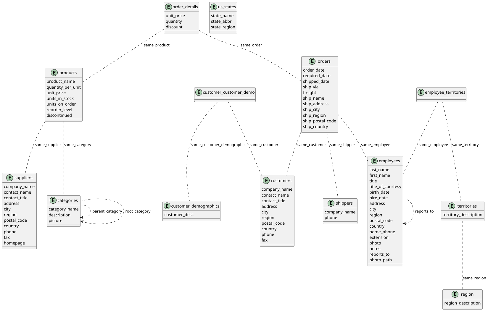

# Usage of korykiai query language (kql)

Korykiai query language aims to formulate queries in
an easily understandable form. Queries are enriched and transformed
to SQL before executed against database system and deliver required
data.

We will use northwind demo database to explain how to use **kql**.
At first, korykiai will not use database schema directly, but uses
an entity model on top of database schema. We can use business terms
and need not know all technical stuff required by databases.

Users with SQL-knowledge should have in mind, that **kql** is quite
different from SQL, but intend to pursue the same objectives for data
retrieval.

We have to know what data is in the database. This is shown in following diagram.

## A sample query

Let's have a closer look on the example from README.md

    FIND customers c, c-orders o
    FILTER count(o) > 10 AND
        o.order_date BETWEEN DATE '2023-01-01' AND DATE '2023-01-31'
    FETCH c.company_name, count(o)
    ORDER count(o) DESC

In this query we use four of the major keywords: **FIND**, **FILTER**, **FETCH**, **ORDER**.

### FIND-Clause

Keyword **FIND** is followed by a first entity and optional a list of links.
The purpose of **FIND** is to define the entities and entity-relations we are looking for.
The first entity `costomers` followed by alias `c`. We will refer to the alias inside the query.

Second we have the link `c-orders o`. We say entity `c` is linked to entity
`orders` with alias `o`. But we do not define the kind of link, instead we use
the anonymous form '-'. As you see in ER diagram there is only one link from
`customers` to `orders`, that's when anonymous form is valid.
We could also write the same link in form `c-same_customer-orders o`, specifying the kind of link.
We used a non-optional link, we only search for `customers` who have `orders`. Customers without any order
will not appear in result.

To use an optional link we write `c+orders o` or `c-same_customer+orders o`. Use `+` for optional links.

The link `same_customer` has no direction. But have a look at entity `employees` in ER diagram.
The link `report_to` has a direction. It does matter who gives the report and who gets the report - aka: how is the boss?
Use `>` or `<` for forward or backward directed links.

To write optional directed links we write:

    FIND employees emp, emp - report_to +> employees boss

If we want to write optional backward directed link, write:

    FIND employees boss, boss <- report_to + employees emp

We can use more than one character as alias and whitespaces and linebreaks don't matter.

### FILTER-Clause

Keyword **FILTER** is followed by one logical expression. A logical expression can be a composition of
logial expressions using **AND**, **OR** and **NOT**.

    a AND b OR NOT c

For better reading we can introduce brackets. The expression is equivalent to:

    (a AND b) OR (NOT c)

a, b and c are unary logical expressions like:

    emp.last_name LIKE 'A%'
    emp.date_of_birth BETWEEN DATE '2002-01-01' AND  DATE '2002-12-31'
    count(o) > 10
    emp.home_phone ISNULL

Each unary logical expression resolve to true or false.

### FETCH-Clause

Keyword **FETCH** is followed by a colon separated list of expressions the query should give as result-columns.

Each FETCH-expression can have an optional header.

### ORDER-Clause

Keyword **ORDER** is followed by a colon separated list of expressions to sort the result.

## Nested Queries

We can use nested queries in expression. Let's search for products priced higher than the average price of product category.

    FIND products p, p-categories c, p-suppliers s
    FILTER p.unit_price > (
        FIND products p2, p2-categories c2
        FILTER c2.category_name = c.category_name
        FETCH avg(p2.unit_price)
    )
    AND p.units_in_stock < p.reorder_level AND s.country IN ('USA', 'UK', 'Germany')
    FETCH s.company_name, c.category_name, p.product_name, p.unit_price, p.units_in_stock, p.reorder_level
    ORDER p.unit_price DESC

The first expression in FILTER-Clause selects the average price of product category.
Have a look at nested FILTER-Clause. We can compare category_names from inside and outside nested query.
Entities defined in the enclosing query are visible in the nested query.

## Set-Operation

We can connect resultsets of queries using SET-Operators. This is best explained on an
example:

    FIND products p, p-suppliers s
    FILTER p.units_in_stock < 20 AND NOT p.discontinued = 1
    FETCH p.product_name, s.company_name supplier
    
    INTERSECT
    
    FIND products p, p-order_details od, p-suppliers s, od-orders o
    FILTER o.order_date >= DATE '2023-01-01' AND sum(od.quantity) > 1000
    FETCH p.product_name, s.company_name supplier
    
    MINUS
    
    FIND products p, p-suppliers s
    FILTER p.units_on_order > 0
    FETCH p.product_name, s.company_name supplier

At first, we search products low in stock, at second we search for products with high demand.
Products low in stock and high on demand pass `INTERSECT` operation.
At last, we search for products already ordered and extract these products from result using
`MINUS`operator.

Result shows products low in stock and high on demand and not yet ordered.

Be careful using SET-Operators like this, it could cause performance issues.

## Query-Blocks

Next language feature of **kql** are query-blocks. We can define query-blocks and reuse in other queries.

    WITH sales AS (
        FIND orders o, o-order_details d
        FILTER sum(d.unit_price * d.quantity) sum
        ORDER sum DESC
        LIMIT 1
    )
    FIND employees e, e-sales s
    FETCH e.last_name, e.first_name, e.home_phone

We use a query-block just by using its name in FROM-Clause. They are like custom-made entities.
The link `e-salges s` in second FIND-Clause refers to the first entity `orders o` inside query block `sales`.
In fact `e-sales s` is equivalent to `e-same_oder-sales s`.

Using query-blocks increases readability and understanding of complex queries.
(Query-blocks are similar to `Common Table Expression` or `CTE` In SQL.)

